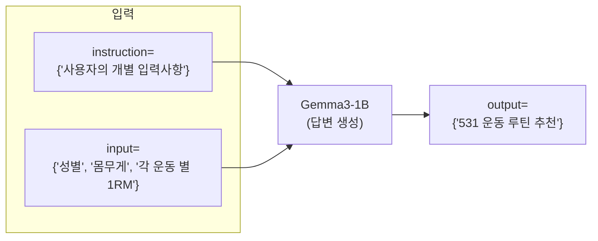

- [모델 학습 설명서](https://github.com/daehyun99/BurnFit-AI-developer-assignment/blob/main/docs/model_training.md) (/docs/model_training.md)

# 프로젝트 개요
- [BurnFit] AI 개발자 과제
- 프로젝트 명
    - LLM 기반 5/3/1 운동 루틴 추천 시스템


## 목표
- 사용자의 운동 경험, 목표, 1RM 기록 등을 바탕으로, 5/3/1 프로그램 기반의 맞춤형 운동 루틴을 생성하는 시스템을 설계하고 구현합니다.

## 마일스톤


## 요구사항 분석
### 사용자 정의
- BurnFit 어플 사용자
    - 사용자는 각 운동 별 본인의 최고 기록(1RM)을 알고 있음을 가정.

### 요구사항
- LLM 모델
    - 모델의 크기는 3B 이하
    - 한국어 입력 및 출력에 대응 가능
- 모델 학습 방식 명시
- 학습 리소스 명시

### 입력/출력 포멧 정의
- input
```py
{
    "instruction": f"{instruction}",
    "input": f"{input}"
}
```

- output
```py
{
    "output": f"{output}"
}
```

# 모델 정보 및 학습 요약
- [모델 학습 설명서](https://github.com/daehyun99/BurnFit-AI-developer-assignment/blob/main/docs/model_training.md) (/docs/model_training.md)
- 모델 정보 : Gemma3-1B
- 연산 자원 : V2 TPU 8개
- 학습 방식 : Lora

# 실행 방법
- FastAPI 서버 실행: [Colab](https://colab.research.google.com/drive/136btY15Ar3C2Rj-S_1jGkjuMCO38nFDt?usp=sharing)
    - `Colab`환경에서 `ngrok` 서버 배포
    - `ngrok` 서버 접속 및 `Readme.md` 하단의 **유저 입력 샘플** 입력
    - 🛑 로컬 실행 시, `gemma`라이브러리에서 오류 발생 (반드시 Colab 환경 실행 필요)
- Data 전처리 :
    - .env 파일 생성 및 입력
    ```sh
    OPENAI_API_KEY=""
    ```
    - 가상환경 및 패키지 설정
    ```py
    # 가상환경 설정
    conda create -n burnfit python=3.11
    conda activate burnfit

    # 패키지 설치
    pip install -r requirements.txt

    # /data의 .ipynb을 활용하여, 데이터 전치리 수행
    ```
# 사용한 라이브러리 및 환경 정보
- 개발 환경
    - 데이터 전처리 및 모델 학습
        - Colab
        - Local
    - FastAPI-server
        - Local
    - 배포
        - Colab + ngrok
    

- 프로그래밍 언어
    - Python = 3.11
- 기술 스택
    - fastapi
    - gemma
    - openai
    - pandas
    - scikit-learn
    - matplotlib
    
---
## 커밋 타입
- Feat : 기능 개발
- Fix : 버그 수정
- Docs : 문서 작성
- Prompt : 프롬프트 개선
- Data : 데이터 수집, 처리, 분석
- Model : AI 모델 학습
- Deploy : 배포 관련

---
## 예시 사용자 루틴 생성 결과
- 샘플1
```py
{
    "instruction": f"{instruction}",
    "input": f"{input}"
}
```
- 샘플2
```py
{
    "instruction": f"{instruction}",
    "input": f"{input}"
}
```
- 샘플3
```py
{
    "instruction": f"{instruction}",
    "input": f"{input}"
}
```