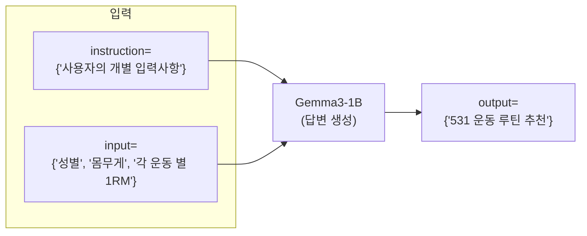

# README.md
### 주요 파일
- [모델 학습 설명서](https://github.com/daehyun99/BurnFit-AI-developer-assignment/blob/main/docs/model_training.md) (/docs/model_training.md)
- [Gemma3-1B 파인튜닝 모델(구글 드라이브)](https://drive.google.com/drive/folders/1-42plqywNzfa0OqLdnm_9D1PsBCms7jj?usp=sharing)
- [학습용 데이터 샘플 (lora-training1)](https://github.com/daehyun99/BurnFit-AI-developer-assignment/blob/main/data/sample-dataset/lora-training1.json)
- [학습용 데이터 샘플 (lora-training2)](https://github.com/daehyun99/BurnFit-AI-developer-assignment/blob/main/data/sample-dataset/lora-training2.json)

# 1. 프로젝트 개요
- [BurnFit] AI 개발자 과제
- 프로젝트명 : LLM 기반 5/3/1 운동 루틴 추천 시스템
- 프로젝트 수행 기간 : 2025-05-03 ~ 2025-05-12

### 입력/출력 포멧
- 입력
    ```py
    {
        "instruction": f"{instruction}",
        "input": f"{input}"
    }
    ```

- 출력
    ```py
    {
        "output": f"{output}"
    }
    ```

## 1-1. 프로젝트 관리 (Gantt chart)


## 1-2. 목표
- 사용자의 운동 경험, 목표, 1RM 기록 등을 바탕으로, 5/3/1 프로그램 기반의 맞춤형 운동 루틴을 생성하는 시스템을 설계하고 구현합니다.

## 1-3. 요구사항 분석
### 사용자 정의
- BurnFit 어플 사용자
    - 사용자는 각 운동 별 본인의 최고 기록(1RM)을 알고 있음을 가정.

### 요구사항
- 사용 가능한 LLM은 **3B 이하** 크기의 모델이어야 합니다.
- **한국어 입력 및 출력에 대응할 수 있어야** 합니다.
- 학습 방식은 자유 (예: full fine-tuning, LoRA, QLoRA, prompt tuning 등)
- 학습 및 추론은 **로컬 또는 클라우드 환경 모두 사용 가능**하며, 사용한 리소스를 문서에 명시해주세요.

# 2. 모델 정보 및 학습 요약
- [모델 학습 설명서](https://github.com/daehyun99/BurnFit-AI-developer-assignment/blob/main/docs/model_training.md) (/docs/model_training.md)
- 사용한 모델: `Gemma3-1B`
- 학습 방식 : `LoRA`
- 학습 환경: Google Colab, v2-8 TPU 사용
- 학습 방식 구체적 기술
    - 학습 데이터 구성 전략
        1. `GPT-4o-mini`와 `프롬프트 엔지니어링`을 활용하여, 531 프로그램 데이터 생성
        2. Kaggle의 파워리프팅 대회 데이터를 통한, 유저들의 신체 정보 및 1RM 데이터 확보
        3. `GPT-4o-mini`와 `프롬프트 엔지니어링`을 활용하여, 531 프로그램 루틴 추천 데이터 생성
    - 반복/세트/중량 계산 방식 반영 여부
        1. 모델의 답변 생성 간에, CoT(Chain of Thought)방식을 활용하였습니다.
            - 사용자의 1RM에 대한 TM을 계산 후, 각 주차별 중량을 계산하여 정확도 향상
- 비용(데이터 생성 + 모델 학습 및 평가)

    | 비용 | OpenAI API input tokens($) | OpenAI API output tokens($) | Colab 컴퓨팅 단위($) | 합계($) |
    | --- | --- | --- | --- | --- |
    | 데이터 생성 + 모델 학습 및 평가 | 1,961,116($0.29) | 2,535,694($1.52) | 5.96($0.59) | $2.4 |

# 3. 실행 방법
## 3-1. FastAPI 서버 실행: [FastAPI (Colab)](https://colab.research.google.com/drive/136btY15Ar3C2Rj-S_1jGkjuMCO38nFDt?usp=sharing)
- `Colab`환경에서 `ngrok` 서버 배포
    1. `Colab` 파일 복사
    2. Gemma3 모델 구글 드라이브에 업로드 필요 ([Gemma3-1B 파인튜닝 모델(구글 드라이브)](https://drive.google.com/drive/folders/1-42plqywNzfa0OqLdnm_9D1PsBCms7jj?usp=sharing))
    3. ngrok 토큰 입력 필요
    4. `ngrok` 서버 접속 및 `docs/model_training.md`의 **3. 예시 사용자 루틴 생성**의 입력 데이터 활용
- 🛑 로컬 실행 시, `gemma`라이브러리에서 오류 발생 -> Colab 환경 실행 필요
### 예시 사용자 루틴 생성 결과
- Request


- Response


## 3-2. Data 전처리 : (/data/[File-Name].ipynb)
- .env 파일 생성 및 입력
```sh
OPENAI_API_KEY=""
```
- 가상환경 및 패키지 설정
```py
# 가상환경 설정
conda create -n burnfit-data python=3.11
conda activate burnfit-data

# 패키지 설치
pip install pandas openai scikit-learn matplotlib python-dotenv

# /data의 .ipynb을 활용하여, 데이터 전치리 수행
```
# 4. 사용한 라이브러리 및 환경 정보
- 개발 환경
    - 데이터 전처리 및 모델 학습
        - Colab
        - Local : Windows 10
    - FastAPI
        - Local : Windows 10
    - 배포
        - Colab + ngrok
    
- 프로그래밍 언어
    - Python = 3.11
- 라이브러리
    - fastapi
    - gemma
    - openai
    - pandas
    - scikit-learn
    - matplotlib
    
---
## 커밋 타입
- Feat : 기능 개발
- Fix : 버그 수정
- Docs : 문서 작성
- Prompt : 프롬프트 개선
- Data : 데이터 수집, 처리, 분석
- Deploy : 배포 관련
