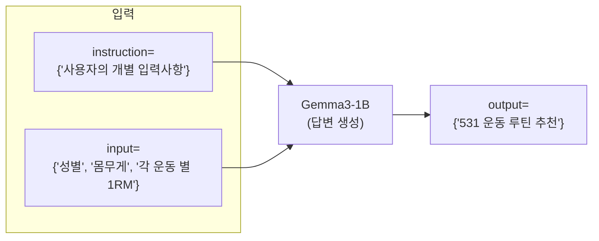

- [모델 학습 설명서](https://github.com/daehyun99/BurnFit-AI-developer-assignment/blob/main/docs/model_training.md) (/docs/model_training.md)
- [Gemma3-1B 파인튜닝 모델(구글 드라이브)](https://drive.google.com/drive/folders/1-42plqywNzfa0OqLdnm_9D1PsBCms7jj?usp=sharing)
- [lora-training1](https://github.com/daehyun99/BurnFit-AI-developer-assignment/blob/data/dataset/lora-training1.json)
- [lora-training2](https://github.com/daehyun99/BurnFit-AI-developer-assignment/blob/data/dataset/lora-training2.json)

# 프로젝트 개요
- [BurnFit] AI 개발자 과제
- 프로젝트 명
    - LLM 기반 5/3/1 운동 루틴 추천 시스템


## 목표
- 사용자의 운동 경험, 목표, 1RM 기록 등을 바탕으로, 5/3/1 프로그램 기반의 맞춤형 운동 루틴을 생성하는 시스템을 설계하고 구현합니다.

## 마일스톤


## 요구사항 분석
### 사용자 정의
- BurnFit 어플 사용자
    - 사용자는 각 운동 별 본인의 최고 기록(1RM)을 알고 있음을 가정.

### 요구사항
- LLM 모델
    - 모델의 크기는 3B 이하
    - 한국어 입력 및 출력에 대응 가능
- 모델 학습 방식 명시
- 학습 리소스 명시

### 입력/출력 포멧 정의
- input
```py
{
    "instruction": f"{instruction}",
    "input": f"{input}"
}
```

- output
```py
{
    "output": f"{output}"
}
```

# 모델 정보 및 학습 요약
- [모델 학습 설명서](https://github.com/daehyun99/BurnFit-AI-developer-assignment/blob/main/docs/model_training.md) (/docs/model_training.md)
- 모델 정보 : Gemma3-1B
- 연산 자원 : V2 TPU 8개
- 학습 방식 : Lora

# 실행 방법
- FastAPI 서버 실행: [Colab](https://colab.research.google.com/drive/136btY15Ar3C2Rj-S_1jGkjuMCO38nFDt?usp=sharing)
    - `Colab`환경에서 `ngrok` 서버 배포
    - `ngrok` 서버 접속 및 `Readme.md` 하단의 **유저 입력 샘플** 입력
    - 🛑 로컬 실행 시, `gemma`라이브러리에서 오류 발생 (반드시 Colab 환경 실행 필요)
- Data 전처리 :
    - .env 파일 생성 및 입력
    ```sh
    OPENAI_API_KEY=""
    ```
    - 가상환경 및 패키지 설정
    ```py
    # 가상환경 설정
    conda create -n burnfit python=3.11
    conda activate burnfit

    # 패키지 설치
    pip install -r requirements.txt

    # /data의 .ipynb을 활용하여, 데이터 전치리 수행
    ```
# 사용한 라이브러리 및 환경 정보
- 개발 환경
    - 데이터 전처리 및 모델 학습
        - Colab
        - Local
    - FastAPI-server
        - Local
    - 배포
        - Colab + ngrok
    

- 프로그래밍 언어
    - Python = 3.11
- 기술 스택
    - fastapi
    - gemma
    - openai
    - pandas
    - scikit-learn
    - matplotlib
    
---
## 커밋 타입
- Feat : 기능 개발
- Fix : 버그 수정
- Docs : 문서 작성
- Prompt : 프롬프트 개선
- Data : 데이터 수집, 처리, 분석
- Model : AI 모델 학습
- Deploy : 배포 관련

---
## 예시 사용자 루틴 생성 결과
### `Colab + ngrok`
- Request


- Response


### 샘플1
- 입력
    ```py
    {
    "instruction": "요즘 벤치가 안 늘어서 고민이야. 벤치 집중 루틴이 포함된 4주 5/3/1 프로그램 부탁해.",
    "input": "{'성별': '남성', '몸무게': 91.1, 'squat_1RM': 245.0, 'press_1RM': 117.2, 'bench_press_1RM': 167.5, 'deadlift_1RM': 275.0}"
    }
    ```
- 출력
    ```py
    {
    "output": "벤치 프레스에 집중하고 싶으시다니 정말 좋은 결정입니다! 531 프로그램은 점진적으로 중량을 증가시키며, 벤치 프레스를 강화하는 데 도움을 줄 수 있습니다.\n\n먼저, 당신의 1RM(들 수 있는 최대 무게)을 기준으로 TM(실제 1RM의 90%)을 계산해보겠습니다.\n\n- **벤치 프레스 TM**: 167.5kg × 0.9 = 150.75kg\n- **스쿼트 TM**: 245kg × 0.9 = 220.5kg\n- **밀리터리 프레스 TM**: 117.2kg × 0.9 = 105.48kg\n- **데드리프트 TM**: 275kg × 0.9 = 247.5kg\n\n이제 주차별로 추천 중량을 안내해드리겠습니다. 벤치 프레스에 집중하기 위해 다른 운동의 중량을 약간 조정하겠습니다.\n\n### 1주차 (TM의 65%, 75%, 85%):\n- **벤치 프레스**: 5회 125kg, 5회 145kg, 5회 이상 165kg\n- **스쿼트**: 5회 150kg, 5회 175kg, 5회 이상 200kg\n- **밀리터리 프레스**: 5회 70kg, 5회 80kg, 5회 이상 90kg\n- **데드리프트**: 5회 150kg, 5회 175kg, 5회 이상 200kg\n\n### 2주차 (TM의 70%, 80%, 90%):\n- **벤치 프레스**: 3회 135kg, 3회 155kg, 3회 이상 175kg\n- **스쿼트**: 3회 160kg, 3회 185kg, 3회 이상 210kg\n- **밀리터리 프레스**: 3회 75kg, 3회 85kg, 3회 이상 95kg\n- **데드리프트**: 3회 160kg, 3회 185kg, 3회 이상 210kg\n\n### 3주차 (TM의 75%, 85%, 95%):\n- **벤치 프레스**: 5회 145kg, 3회 165kg, 1회 이상 185kg\n- **스쿼트**: 5회 175kg, 3회 200kg, 1회 이상 225kg\n- **밀리터리 프레스**: 5회 80kg, 3회 90kg, 1회 이상 100kg\n- **데드리프트**: 5회 175kg, 3회 200kg, 1회 이상 225kg\n\n### 4주차 (TM의 40%, 50%, 60%) (디로드 주):\n- **벤치 프레스**: 5회 75kg, 5회 95kg, 5회 이상 115kg\n- **스쿼트**: 5회 90kg, 5회 110kg, 5회 이상 130kg\n- **밀리터리 프레스**: 5회 40kg, 5회 50kg, 5회 이상 60kg\n- **데드리프트**: 5회 90kg, 5회 110kg, 5회 이상 130kg\n\n이 루틴을 통해 벤치 프레스를 집중적으로 강화할 수 있을 것입니다. 운동을 진행하면서 자신의 몸 상태를 잘 살피고, 필요할 경우 중량을 조절하세요. 꾸준한 노력과 인내가 필요합니다. 당신의 목표를 응원합니다! 힘내세요! 💪"
    }
    ```

### 샘플2
- 입력
    ```py
    {
    "instruction": "하체 근력 향상에 포커스를 맞추고 싶어.",
    "input": "{'성별': '남성', '몸무게': 97.9, 'squat_1RM': 195.0, 'press_1RM': 103.2, 'bench_press_1RM': 147.5, 'deadlift_1RM': 240.0}"
    }
    ```
- 출력
    ```py
    {
    "output": "하체 근력 향상에 집중하고 싶으시다니 정말 멋진 목표입니다! 하체는 전신 운동에 큰 영향을 미치기 때문에, 강한 하체를 만드는 것은 매우 중요합니다. 531 프로그램을 기반으로 주차별로 추천 중량을 안내해드릴게요.\n\n먼저, 당신의 1RM(들 수 있는 최대 무게)을 기준으로 TM(실제 1RM의 90%)을 계산해보겠습니다.\n\n- **스쿼트 TM**: 195kg × 0.9 = 175.5kg\n- **밀리터리 프레스 TM**: 103.2kg × 0.9 = 92.88kg\n- **벤치 프레스 TM**: 147.5kg × 0.9 = 132.75kg\n- **데드리프트 TM**: 240kg × 0.9 = 216kg\n\n이제 주차별로 추천 중량을 안내해드리겠습니다. 하체 근력 향상을 위해 스쿼트와 데드리프트의 중량을 약간 더 증량해드릴게요.\n\n### 1주차 (TM의 65%, 75%, 85%):\n- **스쿼트**: 5회 115kg, 5회 130kg, 5회 이상 150kg\n- **밀리터리 프레스**: 5회 60kg, 5회 70kg, 5회 이상 80kg\n- **벤치 프레스**: 5회 80kg, 5회 95kg, 5회 이상 110kg\n- **데드리프트**: 5회 130kg, 5회 150kg, 5회 이상 170kg\n\n### 2주차 (TM의 70%, 80%, 90%):\n- **스쿼트**: 3회 125kg, 3회 140kg, 3회 이상 160kg\n- **밀리터리 프레스**: 3회 65kg, 3회 75kg, 3회 이상 85kg\n- **벤치 프레스**: 3회 90kg, 3회 105kg, 3회 이상 120kg\n- **데드리프트**: 3회 140kg, 3회 160kg, 3회 이상 180kg\n\n### 3주차 (TM의 75%, 85%, 95%):\n- **스쿼트**: 5회 130kg, 3회 150kg, 1회 이상 170kg\n- **밀리터리 프레스**: 5회 70kg, 3회 80kg, 1회 이상 90kg\n- **벤치 프레스**: 5회 95kg, 3회 110kg, 1회 이상 125kg\n- **데드리프트**: 5회 150kg, 3회 170kg, 1회 이상 190kg\n\n### 4주차 (TM의 40%, 50%, 60%) (디로드 주):\n- **스쿼트**: 5회 70kg, 5회 85kg, 5회 이상 100kg\n- **밀리터리 프레스**: 5회 40kg, 5회 50kg, 5회 이상 60kg\n- **벤치 프레스**: 5회 50kg, 5회 60kg, 5회 이상 70kg\n- **데드리프트**: 5회 70kg, 5회 85kg, 5회 이상 100kg\n\n운동을 진행하면서 자신의 몸 상태를 잘 살피고, 필요할 경우 중량을 조절하세요. 하체 근력을 강화하는 데 집중하면 전반적인 운동 능력도 향상될 것입니다. 당신의 목표를 응원합니다! 힘내세요! 💪"
    }
    ```
### 샘플3
- 입력
    ```py
    {
    "instruction": "건강 유지와 체력 향상이 목표야.",
    "input": "{'성별': '남성', '몸무게': 81.25, 'squat_1RM': 245.0, 'press_1RM': 101.5, 'bench_press_1RM': 145.0, 'deadlift_1RM': 260.0}"
    }
    ```
- 출력
    ```py
    {
    "output": "건강 유지와 체력 향상을 목표로 하신다니 정말 멋진 목표입니다! 531 프로그램을 기반으로 주차별로 추천 중량을 안내해드릴게요. 이 프로그램은 4주 주기로 구성되어 있으며, 각 주차마다 점진적으로 중량을 증가시켜 나갑니다.\n\n먼저, 당신의 1RM(들 수 있는 최대 무게)을 기준으로 TM(실제 1RM의 90%)을 계산해보겠습니다.\n\n- **스쿼트 TM**: 245kg × 0.9 = 220.5kg\n- **밀리터리 프레스 TM**: 101.5kg × 0.9 = 91.35kg\n- **벤치 프레스 TM**: 145kg × 0.9 = 130.5kg\n- **데드리프트 TM**: 260kg × 0.9 = 234kg\n\n이제 주차별로 추천 중량을 안내해드리겠습니다.\n\n### 1주차 (TM의 65%, 75%, 85%):\n- **스쿼트**: 5회 140kg, 5회 160kg, 5회 이상 180kg\n- **밀리터리 프레스**: 5회 65kg, 5회 75kg, 5회 이상 85kg\n- **벤치 프레스**: 5회 85kg, 5회 100kg, 5회 이상 115kg\n- **데드리프트**: 5회 140kg, 5회 160kg, 5회 이상 180kg\n\n### 2주차 (TM의 70%, 80%, 90%):\n- **스쿼트**: 3회 150kg, 3회 170kg, 3회 이상 190kg\n- **밀리터리 프레스**: 3회 70kg, 3회 80kg, 3회 이상 90kg\n- **벤치 프레스**: 3회 95kg, 3회 110kg, 3회 이상 125kg\n- **데드리프트**: 3회 150kg, 3회 170kg, 3회 이상 190kg\n\n### 3주차 (TM의 75%, 85%, 95%):\n- **스쿼트**: 5회 160kg, 3회 180kg, 1회 이상 200kg\n- **밀리터리 프레스**: 5회 75kg, 3회 85kg, 1회 이상 95kg\n- **벤치 프레스**: 5회 100kg, 3회 115kg, 1회 이상 130kg\n- **데드리프트**: 5회 160kg, 3회 180kg, 1회 이상 200kg\n\n### 4주차 (TM의 40%, 50%, 60%) (디로드 주):\n- **스쿼트**: 5회 90kg, 5회 110kg, 5회 이상 130kg\n- **밀리터리 프레스**: 5회 40kg, 5회 50kg, 5회 이상 60kg\n- **벤치 프레스**: 5회 60kg, 5회 75kg, 5회 이상 90kg\n- **데드리프트**: 5회 90kg, 5회 110kg, 5회 이상 130kg\n\n운동을 진행하면서 자신의 몸 상태를 잘 살피고, 필요할 경우 중량을 조절하세요. 꾸준한 운동을 통해 건강과 체력을 향상시킬 수 있습니다. 당신의 목표를 응원합니다! 힘내세요! 💪"
    }
    ```