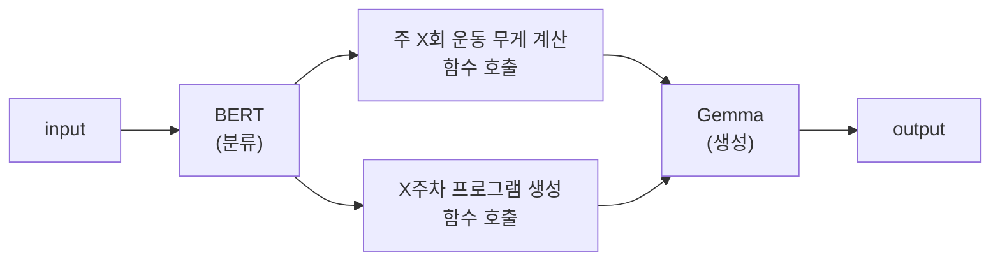

# 프로젝트 개요
- [BurnFit] AI 개발자 과제
- 프로젝트 명
    - LLM 기반 5/3/1 운동 루틴 추천 시스템


## 목표
- 사용자의 운동 경험, 목표, 1RM 기록 등을 바탕으로, 5/3/1 프로그램 기반의 맞춤형 운동 루틴을 생성하는 시스템을 설계하고 구현합니다.

## 요구사항 분석
### 사용자 정의
- BurnFit 어플 사용자
    - 사용자는 본인의 `TM` 또는 `1RM`을 알고 있음을 가정.

### 기능적 요구사항
- 사용자의 입력된 정보에 따른
    - 1RM
    - TM

- 사용자의 운동 수행 능력에 따른
    - 초급자
    - 중급자
    - 상급자

- 사용자의 운동 목표에 따른
    - 근비대
    - 스트렝스
    - 하이브리드

- 사용자의 운동 가능 일정에 따른
    - 주 2회
    - 주 3회
    - 주 4회

### 비기능적 요구사항
- LLM 모델
    - 모델의 크기는 3B 이하
    - 한국어 입력 및 출력에 대응 가능
- 모델 학습 방식 명시
- 학습 리소스 명시

### 입력/출력 포멧 정의
- 사용자의 입력은 BurnFit 앱에서 제공하는 포멧으로 입력받음.
    - 최소 원판단위
    - 각 운동의 최고 기록 (ex - 바벨 백스쿼트 XXkg x회)
        - 스쿼트
        - 데드리프트
        - 오버헤드 프레스
        - 벤치 프레스
    - 목표 프로그램 기간 (ex - 4주, 8주, 12주)
    - 운동 시작을 위한 필수 정보 (ex - 몸무게, 키, 생년월일, 성별)
    - 운동 경험(ENUM)
    - 운동 목표(ENUM)
    - 구체적인 달성 목표(str)
    - 주간 운동 횟수(ENUM)

- input(최소)
```py
{
    "instruction": "{instruction}", # e.g. 사용자의 입력을 바탕으로 5/3/1 파워리프팅 루틴을 구성해주세요.
    "data": {
        "minimum_plate_unit": "{minimum_plate_unit}", # ENUM: 2.5kg 고정
        "lifts": {
            "squat": { "weight": "{weight}", "reps": "{reps}" }, # weight -> float, kg | reps -> INT
            "deadlift": { "weight": "{weight}", "reps": "{reps}" },
            "press": { "weight": "{weight}", "reps": "{reps}" },
            "bench_press": { "weight": "{weight}", "reps": "{reps}" }
        }
        "target_program_duration": "{target_program_duration}", # ENUM: 8 weeks 고정
        "weekly_training_frequency": "{weekly_training_frequency}"  # ENUM: 4 times/week 고정
    }
}
```
- input(추가-개인화)
```py
{
    "instruction": "{instruction}", # e.g. 사용자의 입력을 바탕으로 5/3/1 파워리프팅 루틴을 구성해주세요.
    "data": {
        "minimum_plate_unit": "{minimum_plate_unit}", # ENUM: 0.5kg | 1kg | 1.25kg | 2.5kg
        "lifts": {
            "squat": { "weight": "{weight}", "reps": "{reps}" }, # weight -> float, kg | reps -> INT
            "deadlift": { "weight": "{weight}", "reps": "{reps}" },
            "press": { "weight": "{weight}", "reps": "{reps}" },
            "bench_press": { "weight": "{weight}", "reps": "{reps}" }
        }
        "target_program_duration": "{target_program_duration}", # ENUM: 4 weeks | 8 weeks | 12 weeks
        "body_info": {
            "weight": "{body_weight}", # float, kg
            "height": "{height}", # float, cm
            "birth_date": "{birth_date}", # YYYY-MM-DD
            "gender": "{gender}" # ENUM: Male | Female
        },
        "training_experience": "{training_experience}",  # ENUM: LV_1 | LV_2 | LV_3 | LV_4
        "training_goal": "{training_goal}",  
        # ENUM: Build Max Strength | Get Toned and Defined | Lose Weight Successfully | Improve Athletic Performance | Increase Stamina
        "specific_target": "{specific_target}", # e.g. 데드리프트 1RM 160kg 도달
        "weekly_training_frequency": "{weekly_training_frequency}"  # ENUM: 2 times/week | 3 times/week | 4 times/week
    }
}
```

- output
```py
{
    "data" : {
        "squat": "{}",
        "deadlift": "{}",
        "press": "{}",
        "bench_press": "{}",
        "recommendations": "{recommendations}" # str
            
    }
}
```

## 마일스톤


# 모델 정보 및 학습 요약
- [모델 학습 설명서](https://github.com/daehyun99/BurnFit-AI-developer-assignment/blob/docs/model_training.md)
- 요약 정보 기입

# 실행 방법

# 사용한 라이브러리 및 환경 정보
- 프로그래밍 언어
    - Python
- 기술 스택
    - FastAPI
    - LangChain
    - Hugging-Face
