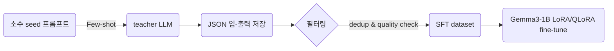

# 모델 학습
- 데이터셋 수집
- 데이터셋 정제 및 전처리

## ALBert 모델 학습 전략

## Gemma3-1B 모델 학습 전략

- 소수 seed 프롬프트 작성
- LLMs(GPT-4o) 답변 생성 파이프라인 작성 : 5,000개 생성
- 필터링
    - 직접 검수(20%): 1,000개
        - 표본 비율 :
        - 표준 오차 :
        - 신뢰 구간 :
