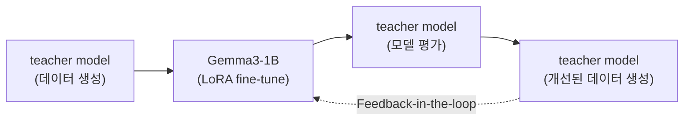
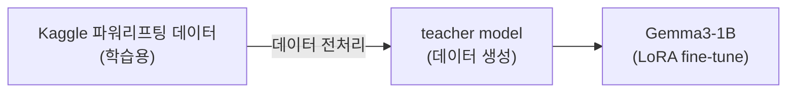
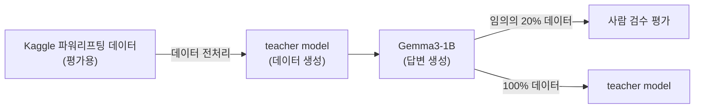

# 모델 학습
## 1. 학습 환경
- 모델: `Gemma3-1B`
- 환경: Google Colab, V2 TPU 8개 사용
- 라이브러리: `gemma 3.0.2`
- 데이터 출처:
    - Kaggle의 파워리프팅 데이터셋
    - Teacher Model: `GPT-4o-mini`를 활용해 학습용 데이터 생성

---

## 2. 모델 학습 과정
### 2-1. 531 프로그램 이해를 위한 학습

- **학습 방식**: LoRA 기반 지도학습
- **목표**: 531 프로그램에 대한 설명 및 이해 능력 향상
- **데이터**:
    1. Teacher model을 활용한 531 프로그램 정보 데이터 생성
- **세부 학습 방식**:
    1. Teacher model(GPT-4o-mini)을 활용해 531 프로그램 관련 설명 데이터 생성 (관련 코드 : [[1]](https://github.com/daehyun99/BurnFit-AI-developer-assignment/blob/main/data/01-01_generate_training_data_with_llm(GPT-4o-mini).ipynb))
    2. 해당 데이터로 Gemma3-1B 모델 지도학습 (관련 코드 : [[2 - Colab]](https://colab.research.google.com/drive/1ytDXXEpQELN29wcKBOxL4jgsN9sIUQKy?usp=sharing))
    3. 학습된 모델의 응답을 다시 teacher model이 평가 (관련 코드 : [[3]](https://github.com/daehyun99/BurnFit-AI-developer-assignment/blob/main/data/01-03_eval-generate_data_with_llm(GPT-4o-mini).ipynb))
    4. 평가 결과를 바탕으로 데이터 개선 → 재학습 (Feedback-in-the-loop 반복)

### 2-2. 531 프로그램 루틴 추천을 위한 학습

- **학습 방식**: LoRA 기반 지도학습
- **목표**: 사용자 상황과 운동 목표에 따라 맞춤형 531 루틴을 추천하는 능력 학습
- **데이터**:
    1. Kaggle 파워리프팅 대회 데이터셋
    2. Teacher model을 활용한 개인 맞춤형 루틴 추천 데이터 생성
- **세부 학습 방식**:
    1. Kaggle 파워리프팅 대회 데이터셋을 기반으로 실제 유저의 신체 정보 및 1RM 데이터 확보 및 데이터 시각화 (관련 코드 : [[4]](https://github.com/daehyun99/BurnFit-AI-developer-assignment/blob/main/data/02-01_dataset_setup.ipynb))
    2. 데이터 전처리 및 Teacher model(GPT-4o-mini)을 활용해 531 프로그램 루틴 추천 데이터 생성 (관련 코드 : [[5]](https://github.com/daehyun99/BurnFit-AI-developer-assignment/blob/main/data/02-02_preprocess_data.ipynb), [[6]](https://github.com/daehyun99/BurnFit-AI-developer-assignment/blob/main/data/02-03_generate_training_data_with_llm.ipynb))
    3. 해당 데이터로 Gemma3-1B 모델 지도학습 (관련 코드 : [[7 - Colab]](https://colab.research.google.com/drive/1NR4BajMfUWV6vHn2MpKIibAY1WYygV30?usp=sharing))
    4. 최종 평가는 하단의 `모델 평가` 참고

---

## 3. 모델 평가
### 3-1. 평가 방법

1. Kaggle 파워리프팅 대회 데이터셋을 기반으로 실제 유저의 신체 정보 및 1RM 데이터 확보(학습데이터와 중복 되지 않은) (관련 코드 : [[4]](https://github.com/daehyun99/BurnFit-AI-developer-assignment/blob/main/data/02-01_dataset_setup.ipynb))
2. 데이터 전처리 및 Teacher model(GPT-4o-mini)을 활용해 531 프로그램 루틴 추천 평가용 데이터 생성 (관련 코드 : [[5]](https://github.com/daehyun99/BurnFit-AI-developer-assignment/blob/main/data/02-02_preprocess_data.ipynb))
3. 해당 데이터로 Gemma3-1B 모델에게 100회의 531 프로그램 루틴 추천 요청 (관련 코드 : [[8 - Colab]](https://colab.research.google.com/drive/1CJzB0g9eRnLYahi0-15_mzICXJkZH0Ao?usp=sharing))
    - **사람 검수 평가**  
        1. 총 100회 루틴 추천 요청 중 20%에 대해 사람이 직접 정성 검토 (관련 코드 : [[9]](https://github.com/daehyun99/BurnFit-AI-developer-assignment/blob/main/data/03-02_eval-final-model-data_with_llm(GPT-4o-mini).ipynb))
        2. 평가 기준에 따라 수동 평가 수행
    - **Teacher 모델 평가**  
        1. 전체 100개 응답을 GPT-4o-mini가 평가 (관련 코드 : [[9]](https://github.com/daehyun99/BurnFit-AI-developer-assignment/blob/main/data/03-02_eval-final-model-data_with_llm(GPT-4o-mini).ipynb))
        2. 평가 기준에 따라 자동화된 평가 수행

### 3-2. 평가 기준
- 모델의 답변에 대한 5가지 항목 중에서 3개 이상의 항목이 적절하다고 판단하면, "적절"로 분류합니다.
- 5가지 항목
    1. 모델이 제시한 각 주차 별 스쿼트 중량이 실제 중량의 10% 오차 범위 이내인 경우, "적절"로 분류합니다.
    2. 모델이 제시한 각 주차 별 밀리터리프레스 중량이 실제 중량의 10% 오차 범위 이내인 경우, "적절"로 분류합니다.
    3. 모델이 제시한 각 주차 별 벤치프레스 중량이 실제 중량의 10% 오차 범위 이내인 경우, "적절"로 분류합니다.
    4. 모델이 제시한 각 주차 별 데드리프트 중량이 실제 중량의 10% 오차 범위 이내인 경우, "적절"로 분류합니다.
    5. 사용자에게 총 4주의 531 프로그램 루틴을 추천하였다면 "적절"로 분류합니다.

### 3-3. 평가 결과

| 평가 방법 | 적절 | 부적절 |
| --- | --- | --- |
| 사람 검수 평가 (본인) | 16 | 4 |
| Teacher model 평가 (GPT-4o-mini) | 61 | 39 |

---

## 4. 모델 학습 비용

| 비용 | OpenAI API input tokens($) | OpenAI API output tokens($원$) | Colab 컴퓨팅 단위($) | 합계($) |
| --- | --- | --- | --- | --- |
| 총 비용 | 1,961,116($0.29) | 2,535,694($1.52) | 5.96($0.59) | $2.4 |

### 2-1. 531 프로그램 이해를 위한 학습
- **OpenAI API**
    1. OpenAI API requests : 240회
    2. OpenAI API input tokens : 174,003
    3. OpenAI API output tokens : 66,200
- **Colab**
    1. Colab 컴퓨팅 단위 : 2.5 소모

### 2-2. 531 프로그램 루틴 추천을 위한 학습
- **OpenAI API**
    1. OpenAI API requests : 1,005회
    2. OpenAI API input tokens : 1,323,165
    3. OpenAI API output tokens : 910,483
- **Colab**
    1. Colab 컴퓨팅 단위 : 2.75 소모

### 3. 모델 평가
- **OpenAI API**
    1. OpenAI API requests : 231회
    2. OpenAI API input tokens : 463,948
    3. OpenAI API output tokens : 61,843
- **Colab**
    1. Colab 컴퓨팅 단위 : 0.71 소모

- > OpenAI API input tokens : Price per 1M tokens $0.15
- > OpenAI API output tokens : Price per 1M tokens $0.60
- > Colab : 100 컴퓨팅 단위 당 $9.99 기준

---

## 5. 결론 및 활용 방안
- **결론**
    1. 데이터 생성 및 평가 과정에서 Teacher model을 활용하여 자동화된 시스템을 도입할 수 있습니다.
    2. 모델이 `531 프로그램 루틴 추천`만 수행한다면, 1B 모델으로도 충분할 것 같습니다.
    3. Teacher model이 생성하는 데이터의 품질을 향상시킨다면, 유저들에게 개인화된 531 프로그램 루틴 추천을 할 수 있을 것 같습니다.

- **활용 방안(서비스화 전략)**:
    1. 초기 : `OpenAI API` + `프롬프트 엔지니어링`을 활용하여, 531 프로그램 루틴 추천 서비스 PoC 도입
    2. 중기 : 서비스를 운영하며 수집된 정보를 바탕으로 데이터셋 구성 및 축적
    3. 장기 : 경량화된 모델(Gemma3-1B 등)을 파인튜닝하여 운영 비용 절감 기대
