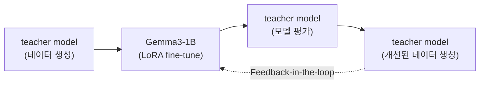
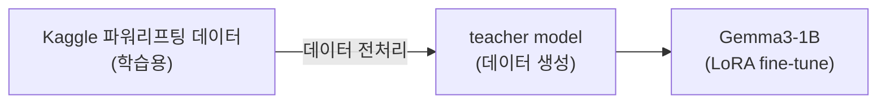
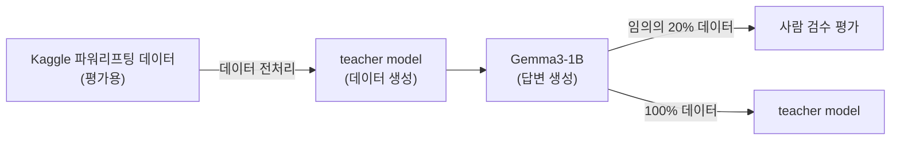

# 제출 항목 (과제 양식)
## 1. 모델 학습 설명서
- 사용한 모델: `Gemma3-1B`
- 학습 방식 : `LoRA`
- 학습 환경: Google Colab, v2-8 TPU 사용
- 학습 방식 구체적 기술 : 문서 하단의 [2. 모델 학습 과정 참고](https://github.com/daehyun99/LLM-531-Workout-Recommender/blob/main/docs/model_training.md#2-%EB%AA%A8%EB%8D%B8-%ED%95%99%EC%8A%B5-%EA%B3%BC%EC%A0%95)
    - 학습 데이터 구성 전략
        1. `GPT-4o-mini`와 `프롬프트 엔지니어링`을 활용하여, 531 프로그램 데이터 생성
        2. Kaggle의 파워리프팅 대회 데이터를 통한, 유저들의 신체 정보 및 1RM 데이터 확보
        3. `GPT-4o-mini`와 `프롬프트 엔지니어링`을 활용하여, 531 프로그램 루틴 추천 데이터 생성
    - 반복/세트/중량 계산 방식 반영 여부
        1. 모델의 답변 생성 간에, CoT(Chain of Thought)방식을 활용하였습니다.
            - 사용자의 1RM에 대한 TM을 계산 후, 각 주차별 중량을 계산하여 정확도 향상
- 데이터 출처:
    - Kaggle의 파워리프팅 데이터셋
    - Teacher Model: `GPT-4o-mini`를 활용해 학습용 데이터 생성

- 모델 학습 비용

    | 비용 | OpenAI API input tokens($) | OpenAI API output tokens($) | Colab 컴퓨팅 단위($) | 합계($) |
    | --- | --- | --- | --- | --- |
    | 데이터 생성 + 모델 학습 및 평가 | 1,961,116($0.29) | 2,535,694($1.52) | 5.96($0.59) | $2.4 |

## 2. 학습 데이터 예시
- 531 프로그램 이해를 위한 학습 데이터 ([학습용 데이터 샘플 (lora-training1)](https://github.com/daehyun99/LLM-531-Workout-Recommender/blob/main/data/sample-dataset/lora-training1.json))
- 531 프로그램 루틴 추천을 위한 학습 데이터 ([학습용 데이터 샘플 (lora-training2)](https://github.com/daehyun99/LLM-531-Workout-Recommender/blob/main/data/sample-dataset/lora-training2.json))

## 3. 예시 사용자 루틴 생성 결과
### 샘플1
- 입력
    ```
    {
        "instruction": "체중 감량도 병행 중이라 볼륨은 너무 많지 않았으면 해.",
        "input": "{'성별': '남성', '몸무게': 96.0, 'squat_1RM': 200.0, 'press_1RM': 91.0, 'bench_press_1RM': 130.0, 'deadlift_1RM': 250.0}"
    }
    ```
- 출력
    ```
    {
        "output": "체중 감량과 함께 운동을 병행하신다니 정말 멋진 목표입니다! 체중 감량을 위해서는 운동의 볼륨을 조절하면서도 효과적으로 근육을 유지하는 것이 중요합니다. 531 프로그램을 기반으로 주차별로 추천 중량을 안내해드릴게요.\n\n먼저, 당신의 1RM(들 수 있는 최대 무게)을 기준으로 TM(실제 1RM의 90%)을 계산해보겠습니다.\n\n- **스쿼트 TM**: 200kg × 0.9 = 180kg\n- **밀리터리 프레스 TM**: 91kg × 0.9 = 81.9kg\n- **벤치 프레스 TM**: 130kg × 0.9 = 117kg\n- **데드리프트 TM**: 250kg × 0.9 = 225kg\n\n이제 주차별로 추천 중량을 안내해드리겠습니다. 볼륨을 줄이기 위해 각 세트의 반복 횟수를 조정하겠습니다.\n\n### 1주차 (TM의 65%, 75%, 85%):\n- **스쿼트**: 5회 122.5kg, 5회 140kg, 5회 이상 155kg\n- **밀리터리 프레스**: 5회 55kg, 5회 65kg, 5회 이상 75kg\n- **벤치 프레스**: 5회 75kg, 5회 85kg, 5회 이상 95kg\n- **데드리프트**: 5회 125kg, 5회 145kg, 5회 이상 165kg\n\n### 2주차 (TM의 70%, 80%, 90%):\n- **스쿼트**: 3회 130kg, 3회 145kg, 3회 이상 160kg\n- **밀리터리 프레스**: 3회 60kg, 3회 70kg, 3회 이상 80kg\n- **벤치 프레스**: 3회 80kg, 3회 90kg, 3회 이상 100kg\n- **데드리프트**: 3회 135kg, 3회 155kg, 3회 이상 175kg\n\n### 3주차 (TM의 75%, 85%, 95%):\n- **스쿼트**: 5회 140kg, 3회 155kg, 1회 이상 170kg\n- **밀리터리 프레스**: 5회 65kg, 3회 75kg, 1회 이상 85kg\n- **벤치 프레스**: 5회 85kg, 3회 95kg, 1회 이상 105kg\n- **데드리프트**: 5회 145kg, 3회 165kg, 1회 이상 185kg\n\n### 4주차 (TM의 40%, 50%, 60%) (디로드 주):\n- **스쿼트**: 5회 75kg, 5회 95kg, 5회 이상 110kg\n- **밀리터리 프레스**: 5회 30kg, 5회 40kg, 5회 이상 50kg\n- **벤치 프레스**: 5회 50kg, 5회 60kg, 5회 이상 70kg\n- **데드리프트**: 5회 75kg, 5회 95kg, 5회 이상 110kg\n\n운동을 진행하면서 자신의 몸 상태를 잘 살피고, 필요할 경우 중량을 조절하세요. 체중 감량과 근육 유지에 도움이 되는 운동을 통해 건강하고 힘든 삶을 만들어가세요! 당신의 목표를 응원합니다! 힘내세요! 💪"
    }
    ```

### 샘플2
- 입력
    ```
    {
        "instruction": "하체 근력 향상에 포커스를 맞추고 싶어.",
        "input": "{'성별': '남성', '몸무게': 97.9, 'squat_1RM': 195.0, 'press_1RM': 103.2, 'bench_press_1RM': 147.5, 'deadlift_1RM': 240.0}"
    }
    ```
- 출력
    ```
    {
        "output": "하체 근력 향상에 집중하고 싶으시다니 정말 멋진 목표입니다! 하체는 전신 운동에 큰 영향을 미치기 때문에, 강한 하체를 만드는 것은 매우 중요합니다. 531 프로그램을 기반으로 주차별로 추천 중량을 안내해드릴게요.\n\n먼저, 당신의 1RM(들 수 있는 최대 무게)을 기준으로 TM(실제 1RM의 90%)을 계산해보겠습니다.\n\n- **스쿼트 TM**: 195kg × 0.9 = 175.5kg\n- **밀리터리 프레스 TM**: 103.2kg × 0.9 = 92.88kg\n- **벤치 프레스 TM**: 147.5kg × 0.9 = 132.75kg\n- **데드리프트 TM**: 240kg × 0.9 = 216kg\n\n이제 주차별로 추천 중량을 안내해드리겠습니다. 하체 근력 향상을 위해 스쿼트와 데드리프트의 중량을 약간 더 증량해드릴게요.\n\n### 1주차 (TM의 65%, 75%, 85%):\n- **스쿼트**: 5회 115kg, 5회 130kg, 5회 이상 150kg\n- **밀리터리 프레스**: 5회 60kg, 5회 70kg, 5회 이상 80kg\n- **벤치 프레스**: 5회 80kg, 5회 95kg, 5회 이상 110kg\n- **데드리프트**: 5회 130kg, 5회 150kg, 5회 이상 170kg\n\n### 2주차 (TM의 70%, 80%, 90%):\n- **스쿼트**: 3회 125kg, 3회 140kg, 3회 이상 160kg\n- **밀리터리 프레스**: 3회 65kg, 3회 75kg, 3회 이상 85kg\n- **벤치 프레스**: 3회 90kg, 3회 105kg, 3회 이상 120kg\n- **데드리프트**: 3회 140kg, 3회 160kg, 3회 이상 180kg\n\n### 3주차 (TM의 75%, 85%, 95%):\n- **스쿼트**: 5회 130kg, 3회 150kg, 1회 이상 170kg\n- **밀리터리 프레스**: 5회 70kg, 3회 80kg, 1회 이상 90kg\n- **벤치 프레스**: 5회 95kg, 3회 110kg, 1회 이상 125kg\n- **데드리프트**: 5회 150kg, 3회 170kg, 1회 이상 190kg\n\n### 4주차 (TM의 40%, 50%, 60%) (디로드 주):\n- **스쿼트**: 5회 70kg, 5회 85kg, 5회 이상 100kg\n- **밀리터리 프레스**: 5회 40kg, 5회 50kg, 5회 이상 60kg\n- **벤치 프레스**: 5회 50kg, 5회 60kg, 5회 이상 70kg\n- **데드리프트**: 5회 70kg, 5회 85kg, 5회 이상 100kg\n\n운동을 진행하면서 자신의 몸 상태를 잘 살피고, 필요할 경우 중량을 조절하세요. 하체 근력을 강화하는 데 집중하면 전반적인 운동 능력도 향상될 것입니다. 당신의 목표를 응원합니다! 힘내세요! 💪"
    }
    ```
### 샘플3
- 입력
    ```
    {
        "instruction": "건강 유지와 체력 향상이 목표야.",
        "input": "{'성별': '남성', '몸무게': 81.25, 'squat_1RM': 245.0, 'press_1RM': 101.5, 'bench_press_1RM': 145.0, 'deadlift_1RM': 260.0}"
    }
    ```
- 출력
    ```
    {
        "output": "건강 유지와 체력 향상을 목표로 하신다니 정말 멋진 목표입니다! 531 프로그램을 기반으로 주차별로 추천 중량을 안내해드릴게요. 이 프로그램은 4주 주기로 구성되어 있으며, 각 주차마다 점진적으로 중량을 증가시켜 나갑니다.\n\n먼저, 당신의 1RM(들 수 있는 최대 무게)을 기준으로 TM(실제 1RM의 90%)을 계산해보겠습니다.\n\n- **스쿼트 TM**: 245kg × 0.9 = 220.5kg\n- **밀리터리 프레스 TM**: 101.5kg × 0.9 = 91.35kg\n- **벤치 프레스 TM**: 145kg × 0.9 = 130.5kg\n- **데드리프트 TM**: 260kg × 0.9 = 234kg\n\n이제 주차별로 추천 중량을 안내해드리겠습니다.\n\n### 1주차 (TM의 65%, 75%, 85%):\n- **스쿼트**: 5회 140kg, 5회 160kg, 5회 이상 180kg\n- **밀리터리 프레스**: 5회 65kg, 5회 75kg, 5회 이상 85kg\n- **벤치 프레스**: 5회 85kg, 5회 100kg, 5회 이상 115kg\n- **데드리프트**: 5회 140kg, 5회 160kg, 5회 이상 180kg\n\n### 2주차 (TM의 70%, 80%, 90%):\n- **스쿼트**: 3회 150kg, 3회 170kg, 3회 이상 190kg\n- **밀리터리 프레스**: 3회 70kg, 3회 80kg, 3회 이상 90kg\n- **벤치 프레스**: 3회 95kg, 3회 110kg, 3회 이상 125kg\n- **데드리프트**: 3회 150kg, 3회 170kg, 3회 이상 190kg\n\n### 3주차 (TM의 75%, 85%, 95%):\n- **스쿼트**: 5회 160kg, 3회 180kg, 1회 이상 200kg\n- **밀리터리 프레스**: 5회 75kg, 3회 85kg, 1회 이상 95kg\n- **벤치 프레스**: 5회 100kg, 3회 115kg, 1회 이상 130kg\n- **데드리프트**: 5회 160kg, 3회 180kg, 1회 이상 200kg\n\n### 4주차 (TM의 40%, 50%, 60%) (디로드 주):\n- **스쿼트**: 5회 90kg, 5회 110kg, 5회 이상 130kg\n- **밀리터리 프레스**: 5회 40kg, 5회 50kg, 5회 이상 60kg\n- **벤치 프레스**: 5회 60kg, 5회 75kg, 5회 이상 90kg\n- **데드리프트**: 5회 90kg, 5회 110kg, 5회 이상 130kg\n\n운동을 진행하면서 자신의 몸 상태를 잘 살피고, 필요할 경우 중량을 조절하세요. 꾸준한 운동을 통해 건강과 체력을 향상시킬 수 있습니다. 당신의 목표를 응원합니다! 힘내세요! 💪"
    }
    ```

## 4. 모델 파일 또는 접근 경로
- [Gemma3-1B 파인튜닝 모델(구글 드라이브)](https://drive.google.com/drive/folders/1-42plqywNzfa0OqLdnm_9D1PsBCms7jj?usp=sharing)

## 5. README.md
- [README.md](https://github.com/daehyun99/LLM-531-Workout-Recommender/tree/main/README.md)

---

## 1. 모델 학습 설명서 세부 내용
### 목차
- 2. 모델 학습 과정
    - 2-1. 531 프로그램 이해를 위한 학습
    - 2-2. 531 프로그램 루틴 추천을 위한 학습
- 3. 모델 평가
    - 3-1. 평가 방법
    - 3-2. 평가 기준
    - 3-3. 평가 결과
- 4. 모델 학습 비용
    - 4-1. (2-1. 531 프로그램 이해를 위한 학습)
    - 4-2. (2-2. 531 프로그램 루틴 추천을 위한 학습)
    - 4-3. (3. 모델 평가)
5. 결론

## 2. 모델 학습 과정
### 2-1. 531 프로그램 이해를 위한 학습

- **학습 방식**: LoRA 기반 지도학습
- **목표**: 531 프로그램에 대한 설명 및 이해 능력 향상
- **데이터**:
    1. Teacher model을 활용한 531 프로그램 정보 데이터 생성 ([학습용 데이터 샘플 (lora-training1)](https://github.com/daehyun99/LLM-531-Workout-Recommender/blob/main/data/sample-dataset/lora-training1.json))
- **세부 학습 방식**:
    1. Teacher model(GPT-4o-mini)을 활용해 531 프로그램 관련 설명 데이터 생성 (관련 코드 : [[01-01]](https://github.com/daehyun99/LLM-531-Workout-Recommender/blob/main/data/01-01_generate_training_data_with_llm(GPT-4o-mini).ipynb))
    2. 해당 데이터로 Gemma3-1B 모델 지도학습 (관련 코드 : [[01-02 (Colab)]](https://colab.research.google.com/drive/1ytDXXEpQELN29wcKBOxL4jgsN9sIUQKy?usp=sharing))
    3. 학습된 모델의 응답을 다시 teacher model이 평가 (관련 코드 : [[01-03]](https://github.com/daehyun99/LLM-531-Workout-Recommender/blob/main/data/01-03_eval-generate_data_with_llm(GPT-4o-mini).ipynb))
    4. 평가 결과를 바탕으로 개선된 학습 데이터 생성 → 재학습 (Feedback-in-the-loop 반복)

### 2-2. 531 프로그램 루틴 추천을 위한 학습

- **학습 방식**: LoRA 기반 지도학습
- **목표**: 사용자 상황과 운동 목표에 따라 맞춤형 531 루틴을 추천하는 능력 학습
- **데이터**:
    1. Kaggle 파워리프팅 대회 데이터셋
    2. Teacher model을 활용한 개인 맞춤형 루틴 추천 데이터 생성 ([학습용 데이터 샘플 (lora-training2)](https://github.com/daehyun99/LLM-531-Workout-Recommender/blob/main/data/sample-dataset/lora-training2.json))
- **세부 학습 방식**:
    1. Kaggle 파워리프팅 대회 데이터셋을 기반으로 실제 유저의 신체 정보 및 1RM 데이터 확보 및 데이터 시각화 (관련 코드 : [[02-01]](https://github.com/daehyun99/LLM-531-Workout-Recommender/blob/main/data/02-01_dataset_setup.ipynb))
    2. 데이터 전처리 및 Teacher model(GPT-4o-mini)을 활용해 531 프로그램 루틴 추천 데이터 생성 (관련 코드 : [[02-02]](https://github.com/daehyun99/LLM-531-Workout-Recommender/blob/main/data/02-02_preprocess_data.ipynb), [[02-03]](https://github.com/daehyun99/LLM-531-Workout-Recommender/blob/main/data/02-03_generate_training_data_with_llm.ipynb))
    3. 해당 데이터로 Gemma3-1B 모델 지도학습 (관련 코드 : [[02-04 (Colab)]](https://colab.research.google.com/drive/1NR4BajMfUWV6vHn2MpKIibAY1WYygV30?usp=sharing))
    4. 최종 평가는 하단의 `모델 평가` 참고

---

## 3. 모델 평가
### 3-1. 평가 방법

1. Kaggle 파워리프팅 대회 데이터셋을 기반으로 실제 유저의 신체 정보 및 1RM 데이터 확보(학습데이터와 중복 되지 않은) (관련 코드 : [[02-01]](https://github.com/daehyun99/LLM-531-Workout-Recommender/blob/main/data/02-01_dataset_setup.ipynb))
2. 데이터 전처리 및 Teacher model(GPT-4o-mini)을 활용해 531 프로그램 루틴 추천 평가용 데이터 생성 (관련 코드 : [[02-02]](https://github.com/daehyun99/LLM-531-Workout-Recommender/blob/main/data/02-02_preprocess_data.ipynb))
3. 해당 데이터로 Gemma3-1B 모델에게 100회의 531 프로그램 루틴 추천 요청 (관련 코드 : [[03-01 (Colab)]](https://colab.research.google.com/drive/1CJzB0g9eRnLYahi0-15_mzICXJkZH0Ao?usp=sharing))
    - **사람 검수 평가**  
        1. 총 100회 루틴 추천 요청 중 20%에 대해 사람이 직접 정성 검토 (관련 코드 : [[03-02]](https://github.com/daehyun99/LLM-531-Workout-Recommender/blob/main/data/03-02_eval-final-model-data_with_llm(GPT-4o-mini).ipynb))
        2. 평가 기준에 따라 수동 평가 수행
    - **Teacher 모델 평가**  
        1. 전체 100개 응답을 GPT-4o-mini가 평가 (관련 코드 : [[03-02]](https://github.com/daehyun99/LLM-531-Workout-Recommender/blob/main/data/03-02_eval-final-model-data_with_llm(GPT-4o-mini).ipynb))
        2. 평가 기준에 따라 자동화된 평가 수행

### 3-2. 평가 기준
- 모델의 답변에 대한 5가지 항목 중에서 3개 이상의 항목이 적절하다고 판단하면, "적절"로 분류합니다.
- 5가지 항목
    1. 모델이 제시한 각 주차 별 스쿼트 중량이 실제 중량의 10% 오차 범위 이내인 경우, "적절"로 분류합니다.
    2. 모델이 제시한 각 주차 별 밀리터리프레스 중량이 실제 중량의 10% 오차 범위 이내인 경우, "적절"로 분류합니다.
    3. 모델이 제시한 각 주차 별 벤치프레스 중량이 실제 중량의 10% 오차 범위 이내인 경우, "적절"로 분류합니다.
    4. 모델이 제시한 각 주차 별 데드리프트 중량이 실제 중량의 10% 오차 범위 이내인 경우, "적절"로 분류합니다.
    5. 사용자에게 총 4주의 531 프로그램 루틴을 추천하였다면 "적절"로 분류합니다.

### 3-3. 평가 결과

| 평가 방법 | 적절 | 부적절 |
| --- | --- | --- |
| 사람 검수 평가<br>(본인) | 16 | 4 |
| Teacher model 평가<br>(GPT-4o-mini) | 61 | 39 |

---

## 4. 모델 학습 비용

| 비용 | OpenAI API input tokens($) | OpenAI API output tokens($) | Colab 컴퓨팅 단위($) | 합계($) |
| --- | --- | --- | --- | --- |
| 데이터 생성 + 모델 학습 및 평가 | 1,961,116($0.29) | 2,535,694($1.52) | 5.96($0.59) | $2.4 |

### 4-1. (2-1. 531 프로그램 이해를 위한 학습)
- **OpenAI API**
    1. OpenAI API requests : 240회
    2. OpenAI API input tokens : 174,003
    3. OpenAI API output tokens : 66,200
- **Colab**
    1. Colab 컴퓨팅 단위 : 2.5 소모

### 4-2. (2-2. 531 프로그램 루틴 추천을 위한 학습)
- **OpenAI API**
    1. OpenAI API requests : 1,005회
    2. OpenAI API input tokens : 1,323,165
    3. OpenAI API output tokens : 910,483
- **Colab**
    1. Colab 컴퓨팅 단위 : 2.75 소모

### 4-3. (3. 모델 평가)
- **OpenAI API**
    1. OpenAI API requests : 231회
    2. OpenAI API input tokens : 463,948
    3. OpenAI API output tokens : 61,843
- **Colab**
    1. Colab 컴퓨팅 단위 : 0.71 소모

- > OpenAI API input tokens : Price per 1M tokens $0.15
- > OpenAI API output tokens : Price per 1M tokens $0.60
- > Colab : 100 컴퓨팅 단위 당 $9.99 기준

---

## 5. 결론
- **결론**
    1. 모델이 학습한 `531 프로그램 루틴 추천`데이터에 `허리 통증에 의한 데드리프트 중량 감소 요청` 데이터가 많이 분포하여, 전체적으로 데드리프트 중량이 낮게 계산된 것 같습니다.
    2. `531 프로그램 루틴 추천` 데이터의 품질을 향상시킨다면, 계산의 정확도를 높일 수 있을 것 같습니다.
    3. `531 프로그램 루틴 추천` 데이터의 사용자 요청사항을 다양하게 생성한다면, 유저들에게 개인화된 531 프로그램 루틴 추천을 할 수 있을 것 같습니다.

